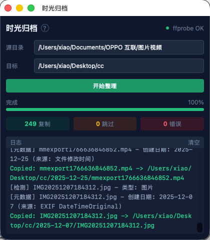

# 时光归档 (Time Archive)

一款精致小巧的跨平台桌面工具，按照媒体文件的**原始拍摄时间**自动整理照片和视频。



## 功能特性

- **智能日期提取** - 从媒体文件内部元数据获取创建时间，而非系统文件时间
  - 图片：读取 EXIF 信息（DateTimeOriginal、CreateDate）
  - 视频：通过 ffprobe 读取 creation_time 元数据
- **按日期归档** - 自动创建 `YYYY-MM-DD` 格式的文件夹结构
- **智能去重** - 基于 MD5 校验，相同文件自动跳过，不同内容同名文件添加后缀
- **实时日志** - 显示详细的元数据检测过程和处理结果
- **一键安装依赖** - 自动检测 ffprobe 并提供一键安装功能

## 支持格式

| 类型 | 格式 |
|------|------|
| 图片 | JPG, JPEG, PNG, HEIC, HEIF, WEBP, TIFF, RAW, CR2, NEF, ARW |
| 视频 | MP4, MOV, AVI, MKV, WMV, FLV, WEBM, M4V |

## 安装

### 下载

从 [Releases](https://github.com/xpwsgg/media_cc/releases) 下载：

- **macOS**: `.dmg`
- **Windows**: `.msi` / `.exe`
- **Linux**: `.deb` / `.AppImage`

### ffprobe (可选)

视频元数据提取需要 ffprobe。应用内置一键安装，或手动安装：

```bash
# macOS
brew install ffmpeg

# Windows
winget install ffmpeg

# Linux
sudo apt install ffmpeg
```

## 使用

1. 启动应用
2. 点击选择源文件夹（包含待整理的媒体文件）
3. 点击选择目标文件夹（整理后的存放位置）
4. 点击"开始整理"

### 特殊处理

- **无元数据文件**: 放入 `1970-01-01` 文件夹
- **重复文件**: MD5 相同则跳过，不同则添加 `_1`, `_2` 后缀

## 技术栈

- **前端**: React 19 + TypeScript + Tailwind CSS 4 + Vite 7
- **后端**: Rust + Tauri 2.0
- **核心库**: kamadak-exif, md-5, walkdir, chrono, thiserror

## 开发

```bash
# 安装依赖
pnpm install

# 开发模式
pnpm tauri dev

# 构建
pnpm tauri build
```

## 项目结构

```
├── src/                    # React 前端
│   ├── App.tsx
│   ├── main.tsx
│   └── index.css
├── src-tauri/              # Rust 后端
│   ├── src/
│   │   ├── main.rs         # 入口
│   │   ├── lib.rs          # Tauri 命令
│   │   ├── scanner.rs      # 文件扫描
│   │   ├── metadata.rs     # 元数据提取
│   │   └── copier.rs       # 文件复制
│   └── Cargo.toml
├── vite.config.ts
├── tsconfig.json
└── package.json
```

## 许可证

[MIT](LICENSE)

## 致谢

- [Tauri](https://tauri.app/)
- [kamadak-exif](https://crates.io/crates/kamadak-exif)
- [FFmpeg](https://ffmpeg.org/)
